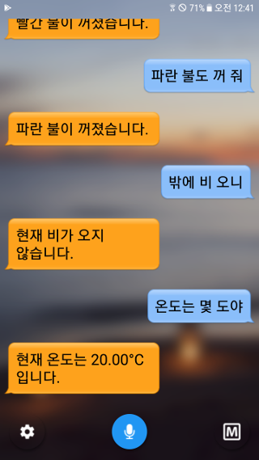

# HomeIoT for Android

HomeIoT 솔루션에서 센서 등을 제어할 수 있는 안드로이드 애플리케이션입니다.

## Preview

## Features

- 음성 인식 기능을 이용하여, 센서를 제어할 수 있습니다. (한국어만 지원)
- Preference 기능을 사용하여, 센서를 수동으로 제어할 수 있습니다.
- 예약 제어 기능을 사용한 경우, 센서가 움직일 때, 알림 기능이 작동합니다.
- 실시간으로 서버와 통신하여, 온도, 습도, 빗물 감지 센서를 모니터링 할 수 있습니다.

## Requirements

- Android 4.4 버전 이상, 8.1 Oreo 버전까지 원활히 지원됩니다..

## Version

해당 레포지터리의 ReleaseNote 를 참조하세요.

## Using Open Source Library

- ButterKnife (https://github.com/JakeWharton/butterknife)
- Eclipse Paho (https://github.com/eclipse/paho.mqtt.java)
- AppIntro2 (https://github.com/apl-devs/AppIntro)
- Lottie Android (https://github.com/airbnb/lottie-android)
- LeakCanary (https://github.com/square/leakcanary)
- Stetho (https://github.com/facebook/stetho)
- FloatingActionButton (https://github.com/Clans/FloatingActionButton)
- RoundedLetterView (https://github.com/pavlospt/RoundedLetterView)